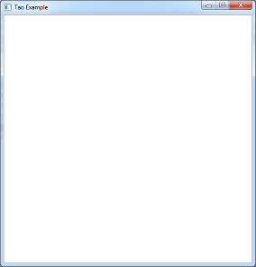

# SrcExPascalABC3DLib
# Библиотеки для разработки игр на PascalABC.Net 

Данная ветка github содержит все необходимые ресурсы серии уроков [Краткий обзор графических библиотек для PascalABC.Net](https://www.youtube.com/watch?v=i9MHZRlUluE&list=PLaHMNOpHDYwrqReYSHzq9zqocgU7RpqT-).

|  |  |
|----:|:----------|
|||
|||
|| |

   